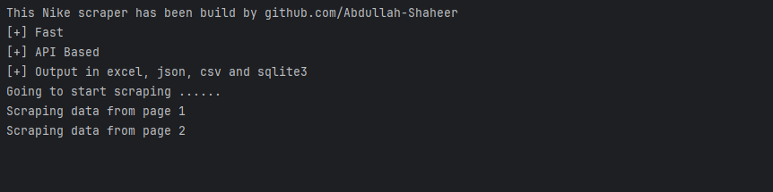

## Nike Scraper



This project is a Python-based scraper that extracts product data from the Nike API. The scraper gathers detailed product information, processes it, and saves the output in multiple formats: JSON, Excel, CSV, and SQLite3. 

## Features

- **Scrapes extensive product data** from the Nike API.
- Outputs product details, including:
  - Product title and subtitle
  - Current price and discount percentage
  - Product URLs and image links
  - Product codes, IDs, and keys
  - Color descriptions and labels
- Saves data in multiple formats for flexibility:
  - JSON
  - CSV
  - Excel
  - SQLite3

## Installation

1. Clone the repository:
   ```bash
   git clone https://github.com/your-username/nike-api-scraper.git
   cd nike-api-scraper
2. Install the dependencies:
   ```bash
   pip install -r requirements.txt

## Usage
1. Run the scraper:-
   ```bash
   python main.py

2. The output files will be saved in the current working directory as:
1. `products.json`
2. `products.csv`
3. `products.xlsx`
4. `products.db`

## Example Output

Below is an example of the data scraped for a single product:

```json
{
  "title": "Nike Air Max",
  "current_price": "120$",
  "discount_percentage": "15%",
  "main_url": "https://www.nike.com/t/air-max",
  "image": "https://nike.com/images/air-max.jpg",
  "product_code": "12345",
  "global_product_id": "98765",
  "group_key": "air-max",
  "color_description": "Black/White",
  "simple_color": "Black",
  "sub_title": "Legendary Comfort",
  "merch_product_id": "merch-56789",
  "internal_pid": "pid-12345",
  "consumer_channel_id": "channel-67890"
}
